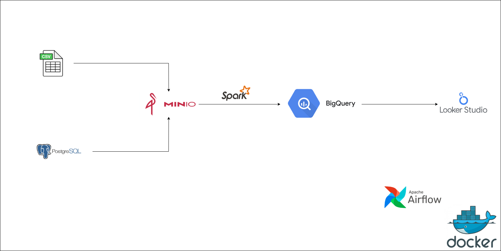
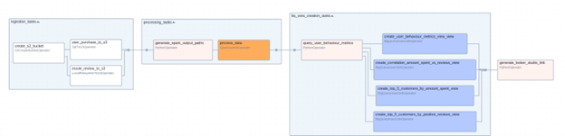

# Batch ETL Pipeline for User Analytics

This project implements a batch ETL (Extract, Transform, Load) pipeline to analyze user behavior data. It uses Apache Airflow for orchestration, Apache Spark for data processing, MinIO for object storage, PostgreSQL as a data source and Airflow backend, and BigQuery for data warehousing. The final output is a data visualization dashboard created with Looker Studio.

## Architecture Diagram



## DAG Graph



## Directory Structure

```
.
├── containers
│   ├── airflow
│   │   ├── Dockerfile
│   │   └── requirements.txt
│   ├── db-init
│   │   └── 1-create-user-purchase.sql
│   └── spark
│       ├── Dockerfile
│       └── spark-start.sh
├── dags
│   ├── __pycache__
│   ├── scripts
│   │   ├── logic
│   │   │   ├── bq_logic.py
│   │   │   └── spark_logic.py
│   │   ├── spark
│   │   └── sql
│   │       └── create_user_behaviour_metrics.sql
│   ├── user_analytics.py
│   └── views
│       ├── correlation_amount_spent_vs_reviews.sql
│       ├── top_5_customers_by_amount_spent.sql
│       ├── top_5_customers_by_positive_reviews.sql
│       └── user_behaviour_metrics_view.sql
├── data
│   ├── movie_review.csv
│   ├── OnlineRetail.csv
│   └── OnlineRetail.csv.1
├── docker-compose.yml
├── jars
│   ├── aws-java-sdk-bundle-1.12.262.jar
│   ├── hadoop-aws-3.3.4.jar
│   └── spark-bigquery-with-dependencies_2.12-0.42.2.jar
├── jobs
│   ├── process_data.py
│   └── test_spark.py
├── logs
├── Makefile
├── plugins
├── README.md
├── service-account.json
├── temp
│   └── s3folder
│       ├── clean
│       │   └── movie_review
│       └── raw
│           └── user_purchase
│               └── user_purchase.csv
└── variables
    ├── airflow_vars.py
    ├── gcp_vars.py
    ├── minio_vars.py
    ├── postgres_vars.py
    ├── __pycache__
    └── spark_vars.py
```

## Getting Started

### Prerequisites

- Docker
- Docker Compose
- Make

### Installation

1.  Clone the repository:
    ```bash
    git clone https://github.com/your-username/Batch-ETL-DuckDB.git
    cd Batch-ETL-DuckDB
    ```
2.  Create a `.env` file from the `.env.example` file and fill in the required values.
3.  Download the required JAR files:
    ```bash
    mkdir -p jars
    wget -P jars/ https://repo1.maven.org/maven2/com/amazonaws/aws-java-sdk-bundle/1.12.262/aws-java-sdk-bundle-1.12.262.jar
    wget -P jars/ https://repo1.maven.org/maven2/org/apache/hadoop/hadoop-aws/3.3.4/hadoop-aws-3.3.4.jar
    wget -P jars/ https://storage.googleapis.com/spark-lib/bigquery/spark-bigquery-with-dependencies_2.12-0.42.2.jar
    ```
4.  Build and start the containers:
    ```bash
    make up
    ```
    This will start the Airflow webserver on `http://localhost:8080`.

## Pipeline Details

The ETL pipeline is orchestrated by an Airflow DAG named `user_analytics_dag`. The pipeline consists of the following steps:

1.  **Ingestion:**

    - A MinIO bucket named `user-analytics` is created.
    - Movie review data is uploaded from a local CSV file (`data/movie_review.csv`) to the MinIO bucket.
    - User purchase data is extracted from a PostgreSQL table (`retail.user_purchase`) and uploaded to the MinIO bucket.

2.  **Processing:**

    - An Apache Spark job (`jobs/process_data.py`) is submitted to a Spark cluster.
    - The Spark job reads the movie review and user purchase data from MinIO.
    - It performs a TF-IDF transformation on the movie review text to create a `positive_review` feature. **Note:** The sentiment analysis logic is currently a placeholder and always classifies reviews as "positive".
    - The processed movie review and user purchase data is then written to BigQuery tables named `movie_review` and `user_purchase`.

3.  **View Creation:**

    - Several views are created in BigQuery to facilitate data analysis:
      - `user_behaviour_metrics_view`
      - `top_5_customers_by_amount_spent_view`
      - `top_5_customers_by_positive_reviews_view`
      - `correlation_amount_spent_vs_reviews_view`

4.  **Visualization:**
    - The DAG also generates a link to a Looker Studio dashboard to visualize the user behavior metrics.

## Airflow Connections

To manually add the required Airflow connections, you can use the following commands:

### MinIO Connection

```bash
docker exec -it scheduler \
  airflow connections add "minio_conn" \
    --conn-type "aws" \
    --conn-extra '{
      "aws_access_key_id": "$MINIO_ACCESS_KEY",
      "aws_secret_access_key": "$MINIO_SECRET_KEY",
      "region_name": "$MINIO_REGION",
      "endpoint_url": "$MINIO_ENDPOINT"
    }'
```

### Google Cloud Connection

```bash
docker exec -it scheduler \
  airflow connections add "google_cloud_default" \
    --conn-type google_cloud_platform \
    --conn-extra '{
      "project": "$GCP_PROJECT_ID"
    }'
```

### Spark Connection

```bash
# Delete the old connection first (optional)
docker exec -it scheduler airflow connections delete spark-conn

# Add the new connection
docker exec -it scheduler \
  airflow connections add spark-conn \
    --conn-type spark \
    --conn-host spark://$SPARK_HOST:7077 \
    --conn-extra '{"deploy-mode": "client", "spark-binary": "spark-submit"}'
```

## Known Issues and TODOs

- **Dummy Sentiment Analysis:** The sentiment analysis in the Spark job is a placeholder and does not perform real sentiment analysis. This should be replaced with a proper sentiment analysis model.
